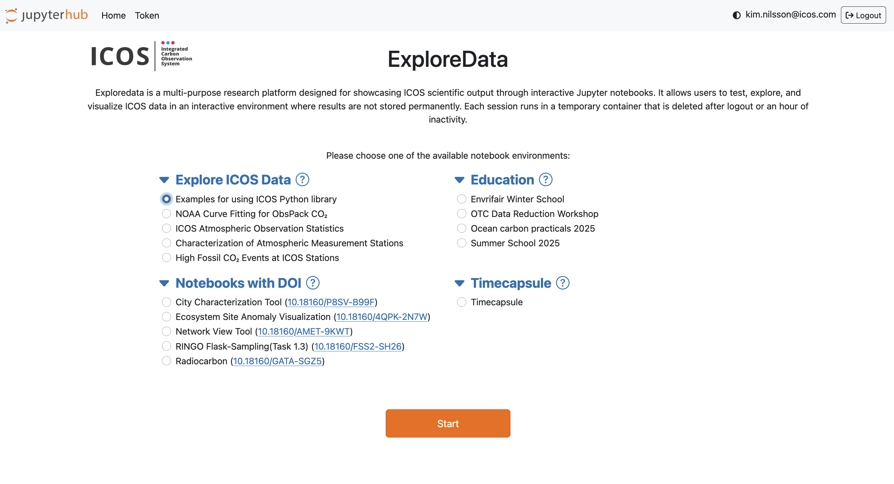
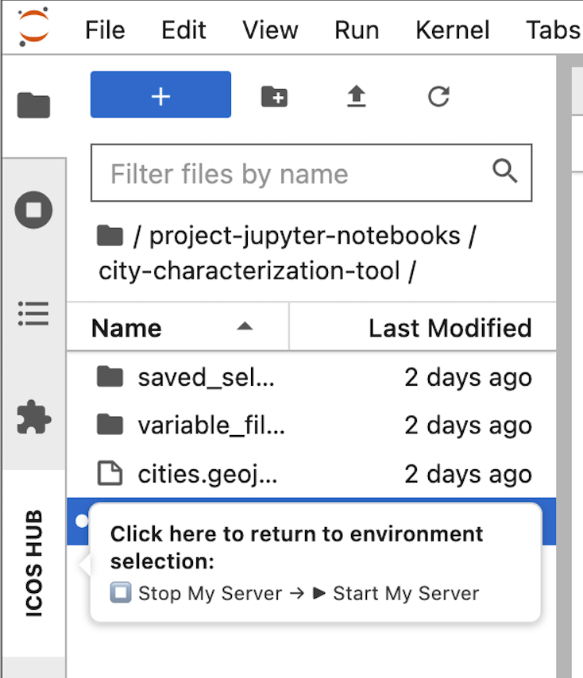

# ExploreData User Guide

ExploreData is the public Jupyter Notebook service provided by the ICOS Carbon Portal. It allows you to explore interactive notebooks, discover ICOS data products, and learn how scientific analyses can be performed within the ICOS Jupyter environment.

!!! note

    ExploreData is intended for exploration and demonstration purposes. Changes made during your session are not saved. Download your notebook before ending your session if you want to keep your work.

## Log in to ExploreData

1. Open your web browser and go to:

   <https://exploredata.icos-cp.eu>

2. Enter your login credentials:

   - **Username:** your email address, for example `kim.nilsson@icos.com`
   - **Password:** request a password using the [ExploreData password request form](<https://www.icos-cp.eu/data-services/services/jupyter-notebook/exploredata-password>)

If you experience login problems, contact:

**jupyter-info@icos-ri.eu**

## Getting started

After logging in, you will see the ExploreData landing page. The page lists several notebook collections.

Expand a category and select a notebook to start exploring.
 

 

If you are new to Jupyter notebooks, start with **Explore ICOS Data**. These notebooks demonstrate typical scientific workflows and show what can be done in the ICOS Jupyter environment.

If you are looking for specific functionality, start with **Examples** in **Explore ICOS Data**. These notebooks demonstrate how to use ICOS Python libraries and data access tools.

## Notebook collections

### Explore ICOS Data

These notebooks demonstrate how ICOS data can be explored, processed, and visualized. 
In particular, the examples illustrating the use of the ICOS Python library provide a good starting point for users who want to develop their own analyses.

#### Examples for using ICOS Python library

The examples in this collection demonstrate how to use the ICOS Carbon Portal Python libraries to:

- Access ICOS data and products
- Retrieve metadata and observations
- Perform analyses of ICOS data and products
- Build your own workflows and applications

The other notebooks in this collection provide examples of:

- Data exploration and analysis
- Statistical calculations
- Interactive maps and plots
- Scientific workflows and project results

Many of these notebooks have been developed in collaboration with researchers from the ICOS scientific community.

### Notebooks with DOI

These notebooks are associated with scientific publications and persistent identified datasets.

They may include:

- Published analysis workflows and code
- Reproducible research examples
- Interactive tools
- Figure-generation scripts

Each notebook is linked to a persistent identifier, such as a PID or DOI, enabling citation and long-term access.

### Education

The Education collection contains notebooks developed for:

- Workshops
- University courses
- Training events
- Self-study

The material has been created by members of the ICOS scientific community and supports learners ranging from students to experienced researchers.

### Timecapsule

The Timecapsule contains a snapshot of all public ExploreData notebooks as they were available in **November 2025**.

These notebooks are preserved for reference and reproducibility. They are no longer updated, but newer versions of many notebooks are available in the other collections.

## Return to the notebook selection page

To return to the ExploreData landing page and select another notebook:

1. Hover over **ICOS HUB** on the left side of the interface.
2. Click **ICOS HUB** to open the Hub Control Panel.
3. Click **Stop My Server**.
4. Wait a few seconds.
5. Click **Start My Server**.

You will be redirected to the ExploreData landing page.

 
## Log out of ExploreData

1. Click **ICOS HUB** on the left side of the interface.
2. Open the **Hub Control Panel**.
3. Click **Logout** in the upper-right corner.

## Need help?

For questions, technical issues, or login problems, contact:

**jupyter-info@icos-ri.eu**
