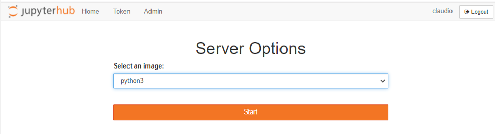
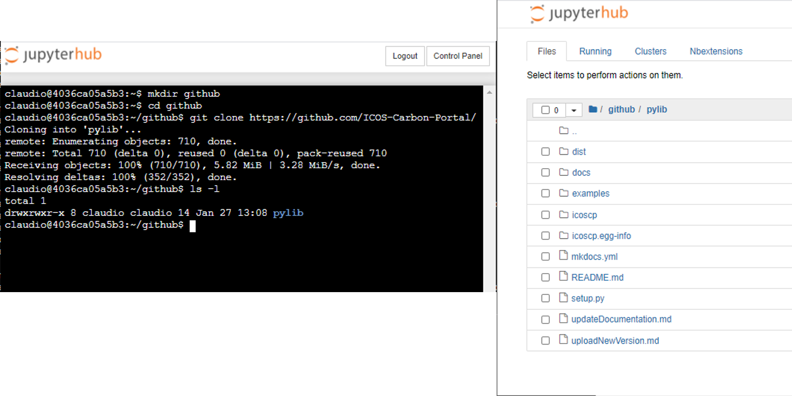
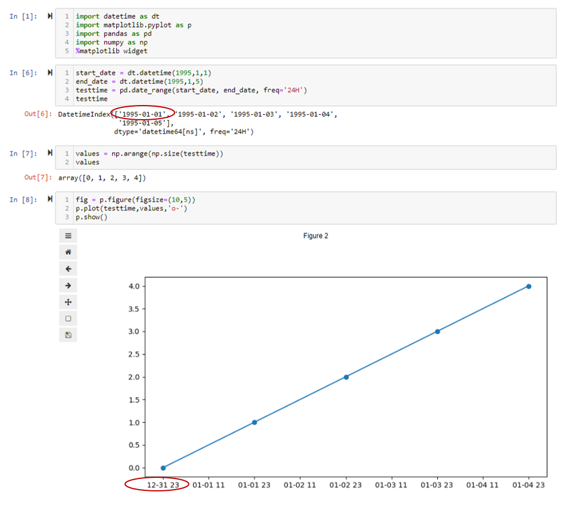

# FAQ

## I am a member of 'project XYZ', but I don't see the project folder.

The docker image, and the user permissions (including access to project folders) are regularly updated. To reflect these updates and changes, you need to restart your server. Top right (after login to the Jupyter Hub), click on control panel and click on 'Stop my Server'. Then click on 'Start My Server' and 'Launch Server' until you see a dropdown list (see image). Select python3 and start.

## Can I get my github repository files?

Absolutley. After login to the jupyter hub, we recommend you create a new folder, for example 'github'. Then you can open a new terminal (top right, in the dropdown 'new' select terminal). This brings up a terminal window in you homedirectory. Change directory into github 'cd github' and clone your desired github repository. For example to have a look at the source code for the icoscp python library, you can do: `git clone https://github.com/ICOS-Carbon-Portal/pylib.git`. Inside the pylib folder you can use the usual git commands ([https://git-scm.com/docs/gittutorial](https://git-scm.com/docs/gittutorial)).

## x-axis with DateTime from Matplotlib is 'wrong'

<a href="../img/xaxis_man.png" target=_blank>

If you plot with matplotlib.pyplot or the pandas convenience function of dataframe.plot(x, y) and you have date/time objects on the x-axis, there is a chance that the x-axis labels are shifted..... There is a lot of 'magic' happening inside Matplotlib to display date time objects with as little effort as possible from the user. This behaviour is using a operating system file which considers time zones and the dates displayed etc..... So, very often the results from Matplotlib are satisfying and good enough for a quick glance at time series data, but depending on operating system, and the time zone your computer lives in and 'when' the time series start strange things are possible to happen. See the example picture. Hence, if you want to 'guarantee' the outcome of the plot, you need to skip the magic, and 'hardcode' the labels from the data set. 

## Is it possible to use Jupyter Lab?
Yes. After you login to [https://jupyter.icos-cp.eu](https://jupyter.icos-cp.eu) you need to modify the address in your internet browser. Change the **?tree** parameter to **lab** 
jupyter notebook link:`https://jupyter.icos-cp.eu/user/myname/tree?` 
jupyter lab link:`https://jupyter.icos-cp.eu/user/myName/lab` 

## Can I install a missing python package?

Yes. You can use pip to install a package into your personal account.
Open a new Python Notebook and issue the command `!pip install myPackage`. But please be aware, that if you collaborate with other people, the package is not available to them. If you think it is worthwhile to have this package/module for all users, drop us an email and we will consider the server side installation.

## How to log-in to ICOS CP Jupyter Hub
Open your internet browser and go to: <b>[https://jupyter.icos-cp.eu](https://jupyter.icos-cp.eu) </b> and enter your login-credentials.

If you wish to access our Jupyter Hub, please apply for a personal account (<a href="https://www.icos-cp.eu/jupyter-personal-account-application" target="_blank">application form</a>), or read more about personal accounts and collaboration on <a href="https://www.icos-cp.eu/data-services/tools/jupyter-notebook">https://www.icos-cp.eu/data-services/tools/jupyter-notebook</a>. Once your request has been accepted, you will receive an email with log-in credentials to your account. In case you experience any problems with you log-in credentials, send us an email to jupyter-info@icos-cp.eu. 

## How to log-in to Exploredata

Open your internet browser and go to: <b>[https://exploredata.icos-cp.eu](https://exploredata.icos-cp.eu) </b> and enter your login-credentials. 
<b><u>Username:</b></u> myEmailAddress (e.g. kim.nilsson@icos.com) 
<b><u>Password:</b></u> **msa**

This is a public service and is supposed to give you a first glance what a Jupyter Notebook looks like and to explore our example notebooks. Be aware that your work is not saved, but you can download your notebook. 

If you experience any problems logging-in to exploredata, send us an email to jupyter-info@icos-cp.eu. 
