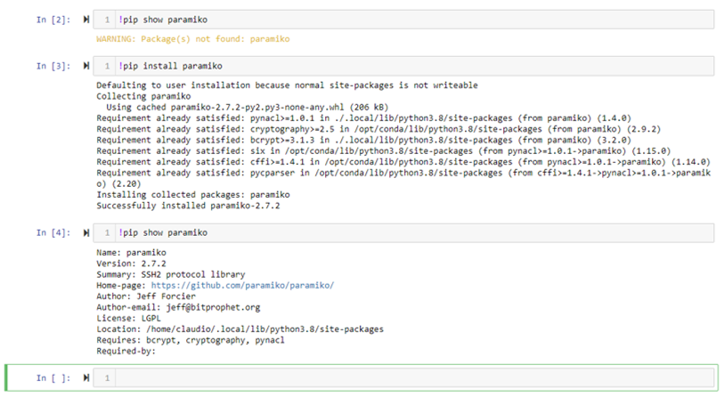

# FAQ

## Is it possible to use Jupyter Lab?
Yes. After you login to [https://jupyter.icos-cp.eu](https://jupyter.icos-cp.eu) you need to modify the address in your internet browser. Change the **?tree** parameter to **lab** 
jupyter notebook link:`https://jupyter.icos-cp.eu/user/myname/tree?` 
jupyter lab link:`https://jupyter.icos-cp.eu/user/myName/lab` 

## Can I install a missing python package?

Yes. You can use pip to install a package into your personal account.
Open a new Python Notebook and issue the command `!pip install myPackage`. But please be aware, that if you collaborate with other people, the package is not available to them. If you think it is worthwhile to have this package/module for all users, drop us an email and we will consider the server side installation.

## How to log-in to ICOS CP Jupyter Hub
Open your internet browser and go to: <b>[https://jupyter.icos-cp.eu](https://jupyter.icos-cp.eu) </b> and enter your login-credentials.

If you wish to access our Jupyter Hub, please apply for a personal account (<a href="https://www.icos-cp.eu/jupyter-personal-account-application" target="_blank">application form</a>), or read more about personal accounts and collaboration on <a href="https://www.icos-cp.eu/data-services/tools/jupyter-notebook">https://www.icos-cp.eu/data-services/tools/jupyter-notebook</a>. Once your request has been accepted, you will receive an email with log-in credentials to your account. In case you experience any problems with you log-in credentials, send us an email to jupyter-info@icos-cp.eu. 

## How to log-in to Exploredata

Open your internet browser and go to: <b>[https://exploredata.icos-cp.eu](https://exploredata.icos-cp.eu) </b> and enter your login-credentials. 
<b><u>Username:</b></u> myEmailAddress (e.g. kim.nilsson@icos.com) 
<b><u>Password:</b></u> **msa**

This is a public service and is supposed to give you a first glance what a Jupyter Notebook looks like and to explore our example notebooks. Be aware that your work is not saved, but you can download your notebook. 

If you experience any problems logging-in to exploredata, send us an email to jupyter-info@icos-cp.eu. 
