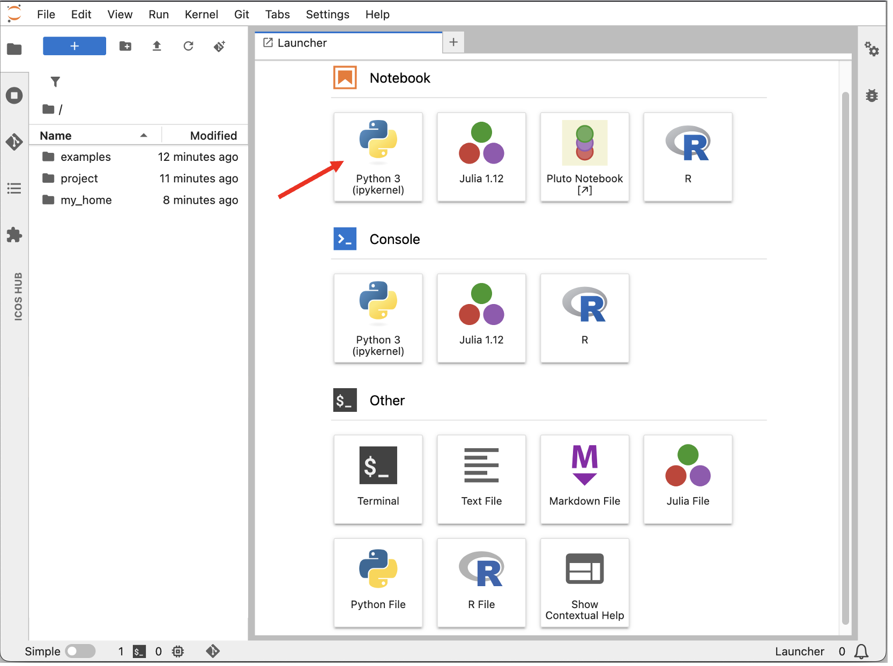
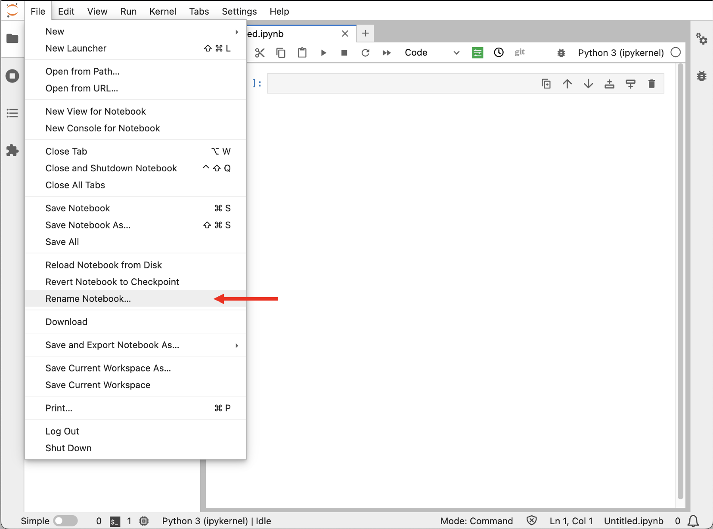
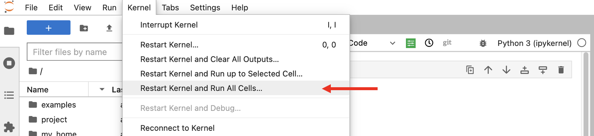
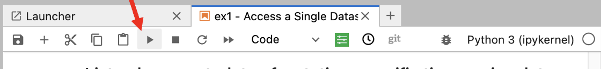
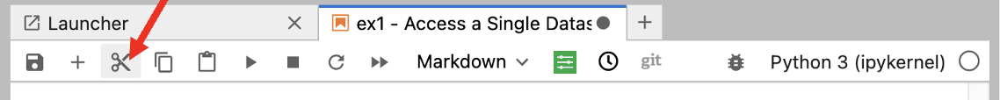
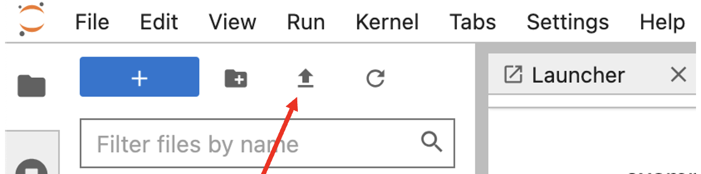

# Your First Jupyter Notebook

This guide is intended for users who are new to Jupyter notebooks in general. It explains the basic actions you need to work with Jupyter notebooks.

## Create a notebook

To create a new notebook:

1. Open the file browser in Jupyter.
2. Select **Python3** in the Launcher window.
 

 

A new browser tab opens with a notebook named `Untitled.ipynb`.

## Rename a notebook

To rename your notebook:

1. Open the notebook.
2. Go to **File**.
3. Click **Rename Notebook...**.
4. Enter the new name.
 

 

## Run all cells in a notebook

To run the whole notebook from the beginning:

1. Go to **Kernel**.
2. Select **Restart & Run All**.
 

 
This restarts the kernel and executes all cells in order.

## Run a single code cell

A notebook consists of cells. To run one cell:

1. Click inside the cell you want to run.
2. Click **Run** in the toolbar, or press **Shift + Enter**.
 

 
Only the active cell is executed. The active cell is highlighted in the notebook interface.

## Use code and Markdown cells

Jupyter notebooks can contain both code and formatted text.

Use a **Code** cell for Python code.

Use a **Markdown** cell for text, headings, explanations, links, and simple formatting.

The current cell type is shown in the dropdown menu in the notebook toolbar. If you are writing Python code, make sure the cell type is set to **Code**.

## Add a new cell

To add a new cell below the active cell, click the **+** button in the toolbar.

## Delete a cell

To delete a cell:

1. Select the cell.
2. Click scissor button in the toolbar.
 

 

## Stop a running notebook

If a cell or notebook is taking too long to run, interrupt the kernel.

You can do this by clicking **Interrupt kernel** in the toolbar, or by going to:

**Kernel → Interrupt**

## Save your notebook

Go to **File → Save Notebook** to save your work.

On the Collaborative Jupyter Hub, files in your home directory or project directory are saved persistently.

On ExploreData, your work is not saved permanently. Download your notebook if you want to keep it.

## Download a notebook

Go to **File → Download** to download a notebook to your local computer.

## Upload a notebook

To upload a notebook:

1. Click the blue upload button on the left toolbar.
2. Select the notebook file from your computer.
3. Click **Open**.
 

 

## Restart your Jupyter server

Restarting your server can help refresh software updates, permissions, and project access.

1. Go to **File → Hub Control Panel**.
2. Click **Stop My Server**.
3. Wait until the server has stopped.
4. Click **Start My Server**.

## Log out

To log out of Jupyter Hub:

1. Go to **File**.
2. Click **Log Out**.
