# How to ...
This part includes some basic instructions on how to login to ICOS Jupyter Hub and start working on your first IPython Notebook. More in particular, you will learn how to:

- login to ICOS CP Jupyter Hub
- get familiar with the existing directory tree and available material
- create and work on your first IPython notebook

 
 

## Log-in to ICOS CP Jupyter Hub
Open your browser (Firefox or Chrome) and go to:

<b>jupyter.icos-cp.eu</b>

Enter your login-credentials in the popup window:

<b><u>Username:</b></u> [user_username]  
<b><u>Password:</b></u> [user_password]

Note that if you wish to access our Jupyter Hub, you will first have to send us an email with your request to jupyter-info@icos-cp.eu. Once your request has been accepted, you will receive an email with log-in credentials to your account. In case you experience any problems with you log-in credentials, send us an email to jupyter-info@icos-cp.eu. 

 
 

## Jupyter Hub directory tree and available material
Once you have successfully logged-in, you will see a list of directories.
 

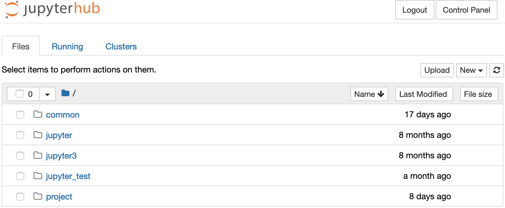

 

*Common* includes all ICOS notebooks that are openly available through [https://exploredata.icos-cp.eu](https://exploredata.icos-cp.eu) (i.e. introduction-to-Python-notebooks, ICOS-notebooks, scientific notebooks and educational notebooks) as well as some additional code snippets. All notebooks that are stored in *common* are read-only, meaning that you may run the notebooks in there, but you cannot change them (no changes will be stored). In order to modify any of the aforementioned notebooks, you need to first download the notebook in question to your computer and then upload it again to the Jupyter Hub (instructions on how to download and upload a notebook are available below).

*Project* includes a list of folders with project names. Users will only be able to see the project folders that they are associated with.
 

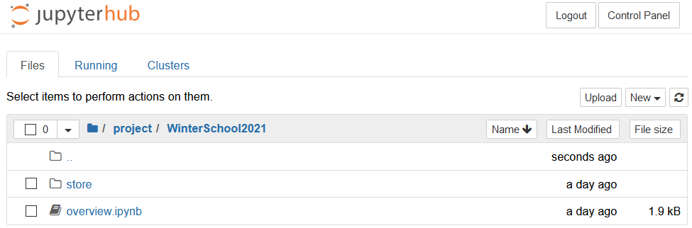

 
In general, all files and folders stored directly under the project group folder are visible and editable by all group members. Every project folder contains a *Store* folder. This folder should only contain stable versions of a group's notebooks. Note that the content of this folder is visible to all group members in *Read only* mode and that only the group administrator is able to update it. *Store* contains a README-file, which, in turn, includes summarized information regarding the:

- aim of the project
- group manager (responsible for scientific aspect & group organization)
- group administrator (ICOS CP team member - responsible for technical support)

The group manager is responsible for managing the group and contacting the group administrator for requests of a technical nature (e.g. creating Jupyter accounts for new members of the group, uploading a new standard version of a notebook to *Store*, etc.).  
The group administrator is an ICOS CP team member that is responsible for the technical support of the project group.

If you have worked with ICOS CP before, you will see one directory with notebooks running on Python 2.7 from a previous ICOS CP Jupyter Hub instance. The name of this directory is *jupyter*.

If you created any notebooks using the previous ICOS CP Jupyter Hub instance running Python 3.6, you will find those under the directory *jupyter3*.

 
 

## Create your first IPython Notebook
To create you first IPython notebook, click on **New --- > Python 3**.
 

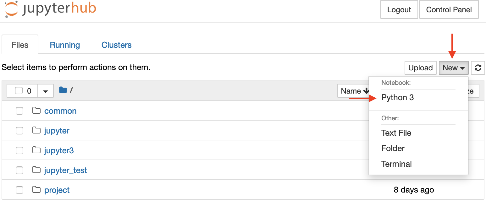

 

A new tab with your IPython notebook will open in your browser. The notebook is titled *Untitled.ipynb*. 

 
 

## Rename your IPython Notebook
If you wish to rename your notebook, you will have to go back to the previous tab including your home directory and then select the notebook you just created and  click on *Shutdown* in the top menu. 
 

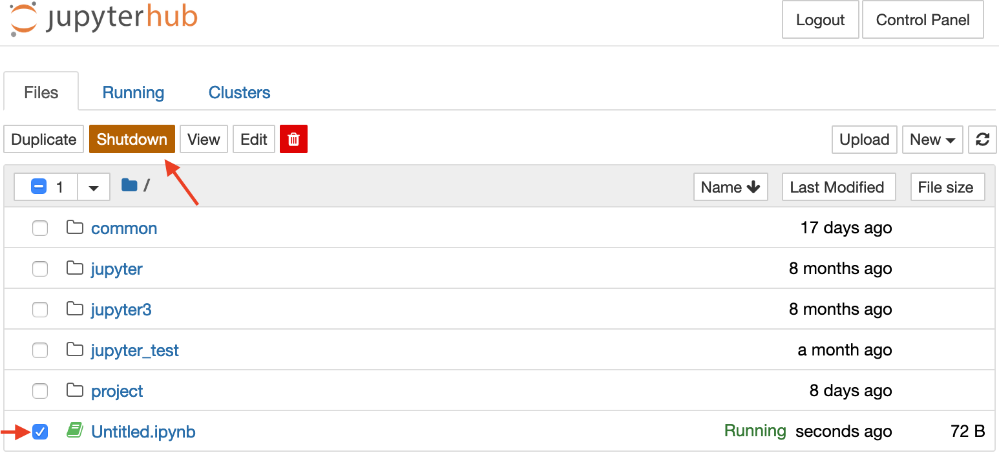

 

Then select it again and click on *Rename*.
 

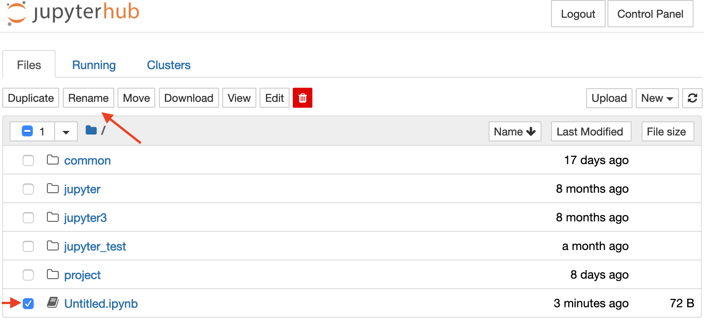

 

Note that you can follow a similar process to rename a folder.

 
 

## Run the Notebook
To run all the code included in a Jupyter Notebook, go to the menu at the top of the page and click on **Kernel** and then **Restart & Run All**.

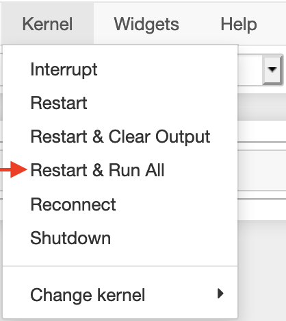

 
 

## Run a single code-cell in the Notebook
A Jupyter Notebook consists of code-cells. It is possible to write Python code in a code-cell and then run it by clicking on **Run** in the menu at the top of the page.

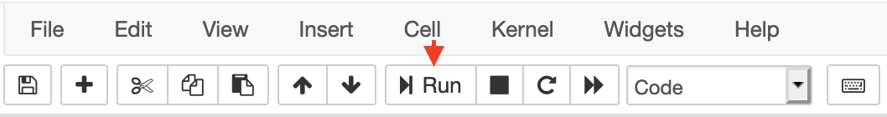

Observe that only one code-cell will be executed, and this is the code-cell that was active when you clicked on Run. You can activate a code-cell just by clicking on it. An active code-cell is highlighted in blue or green colour (see image below).

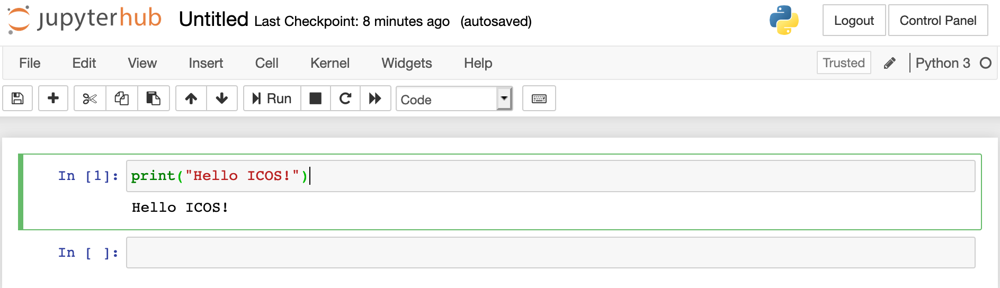

 

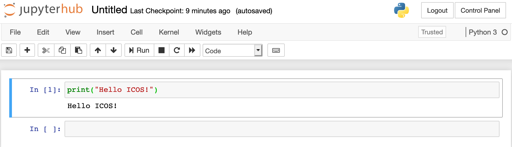

It is also possible to write markup code in a Jupyter Notebook code-cell. For instance, the text you are reading in the notebooks stored under common are written in markup-cells that include markup text and HTML code. When you are writing Python code in a code-cell make sure that the cell is a Python code-cell. The type of the currently active code-cell is shown in the dropdown list on the menu bar at the top of the page (see figure). A code-cell that includes Python code should be marked as Code.

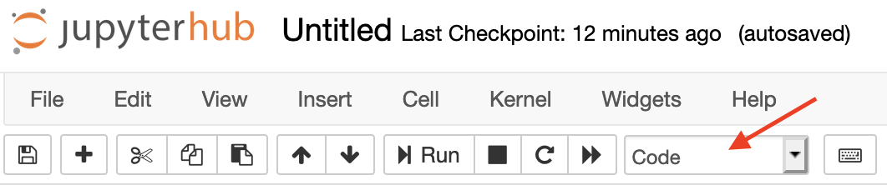

 
 

## Add a new code-cell
Click on "+" in the menu to add a new code-cell under the current active code-cell.

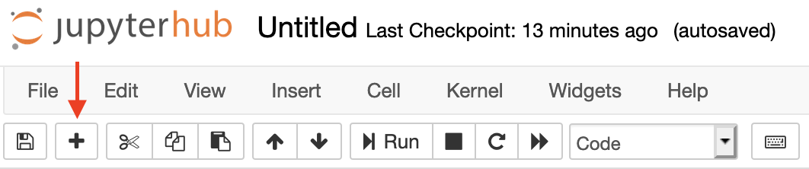

 
 

## Delete a code-cell
If you wish to delete a code-cell, select the code-cell by clicking on it and then go to the menu at the top of the page and click on **Edit** --- > **Delete Cells**.

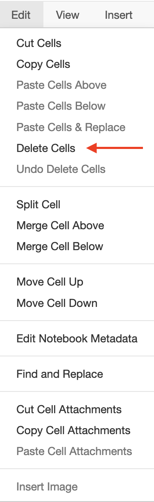

 
 

## Stop Execution
If an execution is taking too long, you can stop your notebook from running by clicking on Interrupt kernel in the menu. Alternatively, another choice is to go to Kernel and click on Interrupt.

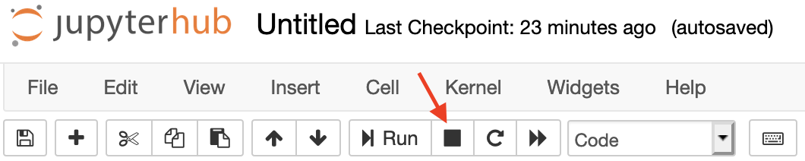

 
 

## Save Notebook
Click on **Save** to save your work.

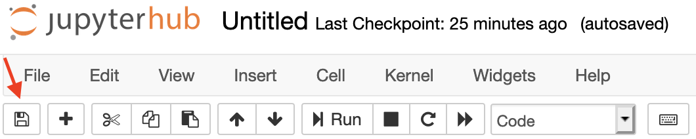

 
 

## Download Notebook
If you wish to download the notebook as a Jupyter Notebook, go to the menu at the top of the page, click on **File** --- > **Save As...** --- > **Notebook(.ipynb)**.

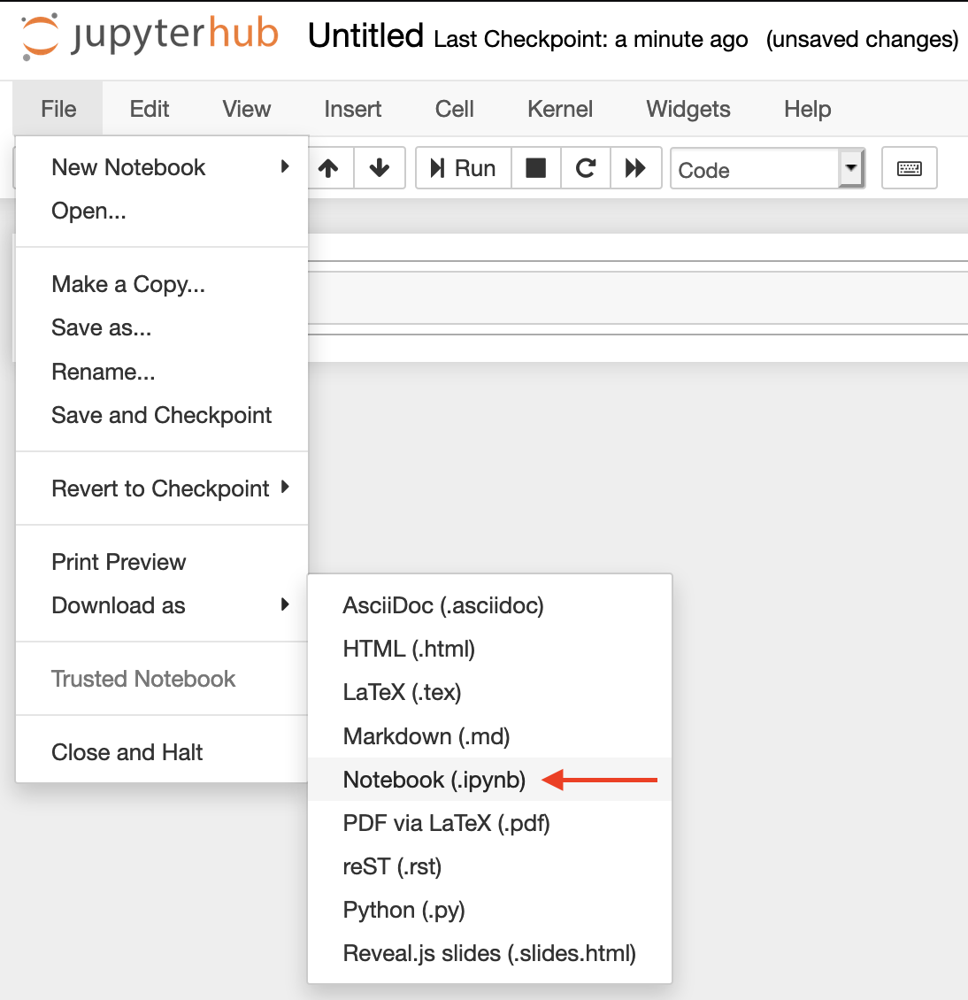

If you wish to save your work as pure Python code, go the menu at the top of the page, click on **File** --- > **Save As...** --- > **Python(.py)**.

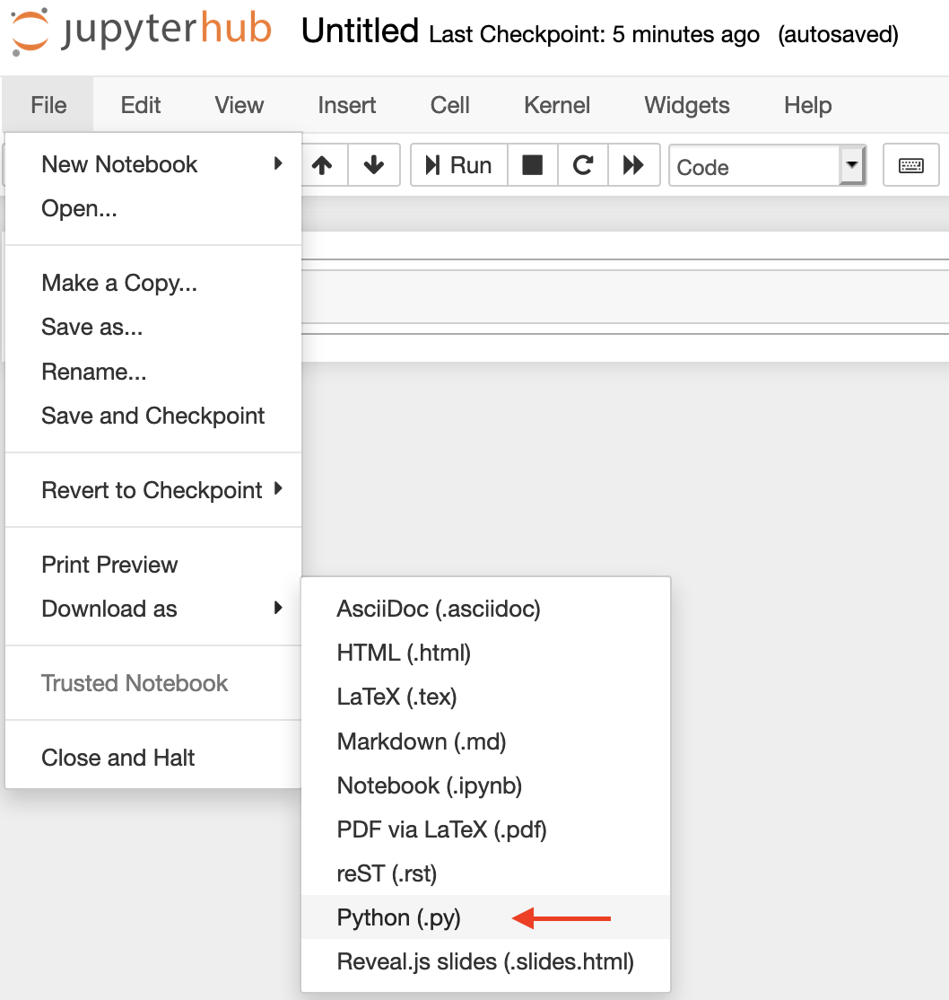

 
 

## Upload Notebook
If you wish to upload a notebook, click on the **Upload** button on the right. In the window that appears, navigate to the location where the notebook is stored, select it and click on **Open**.

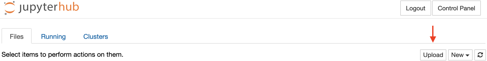

 
 

## Read the docs
For more information on how to work with Jupyter read the official [Jupyter documentation](https://jupyter-notebook.readthedocs.io/en/stable/). 

 
 
