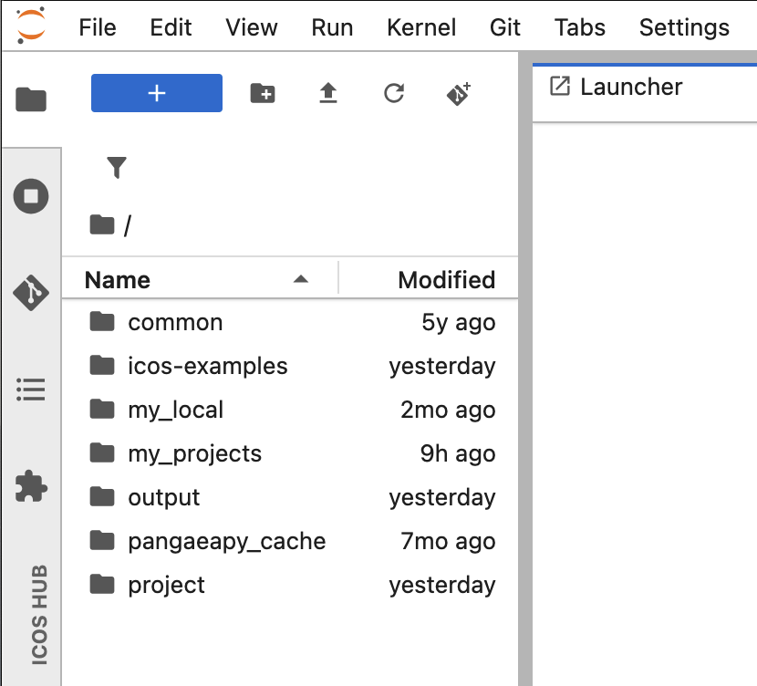

# ICOS Collaborative Jupyter Hub User Guide

The ICOS Collaborative Jupyter Hub provides a secure environment for researchers, project teams, and collaborators to work with ICOS data, develop analysis workflows, and share notebooks within dedicated project spaces.

Unlike the public ExploreData service, the Collaborative Jupyter Hub offers persistent storage, personal workspaces, and shared project areas.

## Access the Jupyter Hub

1. Open your web browser and go to:

   <https://jupyter.icos-cp.eu>

2. Enter your login credentials.

## Request an account

If you do not yet have an account, [apply for a personal account](<https://www.icos-cp.eu/data-services/services/jupyter-notebook/personal-account-application>) through the ICOS Carbon Portal.

Once your application has been approved, you will receive your login credentials by email.

If you experience login or access problems, contact: 

**jupyter-info@icos-ri.eu**

## Understand the workspace

After logging in, you will see directories available to you.

 

 

The content visible in your workspace depends on your permissions and project memberships:

- **examples** directory
- **project** directory with shared project workspaces

## The examples directory

The **examples** directory contains Jupyter notebooks that demonstrate how to use ICOS Python libraries to access, analyze, and visualize ICOS data.

These notebooks are the same as those available through ExploreData and provide useful starting points for your own work.

!!! note

    Notebooks in the examples directory are read-only. You can open and run them, but you cannot save changes to the original files.

## Modify an example notebook

To modify an example notebook:

1. Copy the notebook to your home directory.
2. Work on your copy.
3. Save your changes in your personal workspace or in a project directory.

This keeps the original examples unchanged and available to all users.

## Project spaces

The **project** directory contains shared collaboration spaces.

Each project has its own folder. You will only see folders for projects that you are a member of.

Project spaces allow teams to:

- Share notebooks and scripts
- Collaborate on analyses
- Exchange data and results
- Maintain project-specific documentation

For more information, see the [How-to Guide](how-to.md/#working-in-projects).
