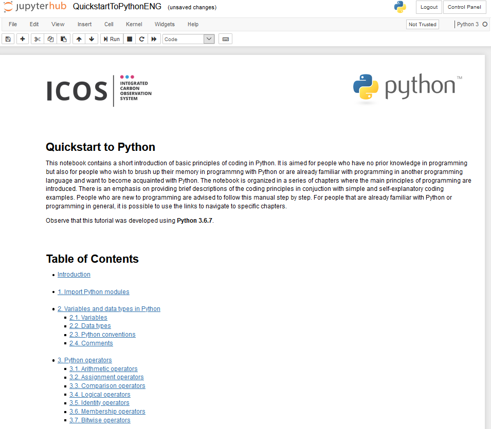
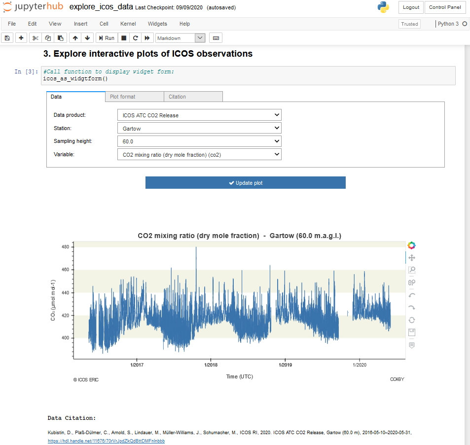
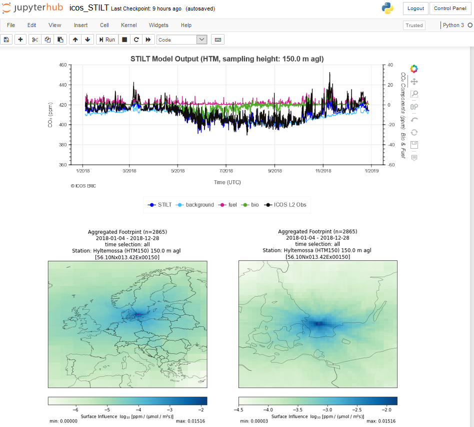
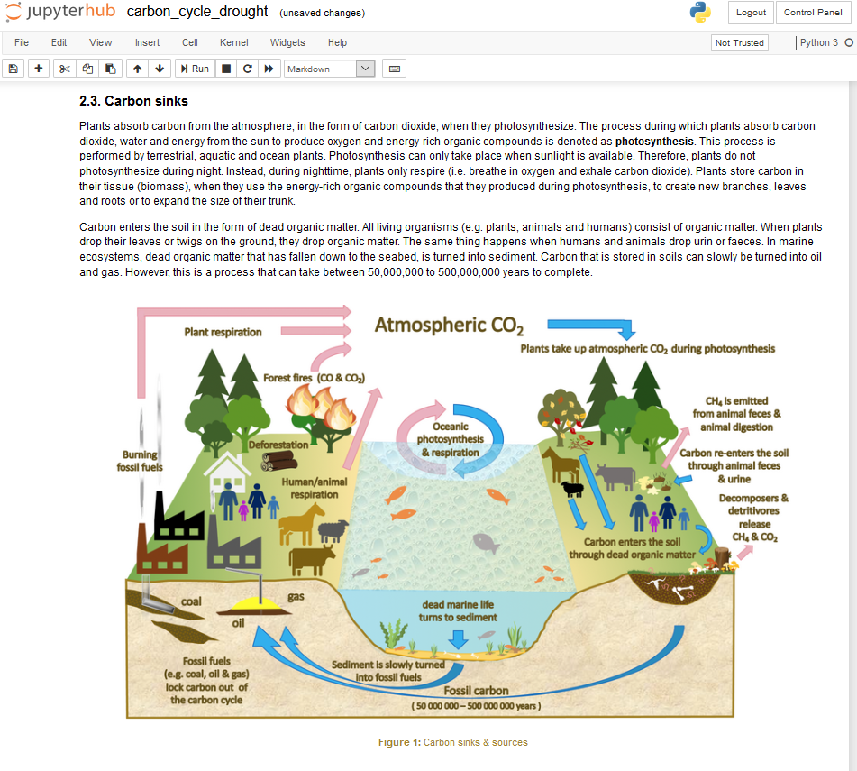

# ICOS Carbon Portal - Notebooks
Just like ICOS Carbon Portal provides different Jupyter solutions for each one of the target user groups, it also provides different notebook types. This part is dedicated to presenting these notebook types as well as what purpose each one of them serves.

The IPython notebooks available through ICOS Carbon Portal, can be divided into 4 categories:

- notebooks that help the user to get started with Python
- notebooks with interactive visualizations for exploring ICOS data
- scientific notebooks
- educational notebooks

All aforementioned notebooks are usually open to the public. The only exception are the scientific notebooks. A scientific notebook can be private before a related article has been published or before a certain project is over. After that, if all contributors agree, the notebook can become publicly available through one of ICOS Carbon Portal's public Jupyter instances.

 
 

## Introductional
The introductory notebooks are aimed for users that are new to programing or, on the contrary, are familiar with programming but in another programming language and wish to quickly learn the syntax of Python. The examples are custom tailored to reflect realistic ICOS use cases. These notebooks can be used by both researchers, educators and students. All examples are custom-tailored to use cases from the ICOS community. 
 
 

 
 

## Explore ICOS data
ICOS Carbon Portal provides notebooks to explore all available ICOS data products. These notebooks include interactive visualizations of ICOS data, that help the user get an overview of data availability, data quality and some statistics. Metadata of the station where the measurements were collected from as well as metadata for each separate measurement are made available through the interactive visualizations. It is for instance also possible to compare measurements from different stations. All plots include text with the citation of the plotted dataset. These notebooks are open access and are aimed for researchers, educators, students and the general public. 
 
 

 
 

## Scientific
Scientific notebooks are aimed for researchers and potentially policymakers. They include well-documented scientific methods applied over ICOS data or a combination of ICOS data and data from other sources. They are usually the result of a collaboration between a group of scientists working together with ICOS Carbon Portal on a research project or article. In this case, the notebook becomes publicly available only after the article has been published. Another possibility, is that the scientific community has requested a tool which then ICOS Carbon Portal has developed in close collaboration with experts in the field. Scientific notebooks include interactive elements that control the content of their visualizations. Visualizations can be static or interactive. Scientific notebooks are a way for scientists to help their work gain more visibility and, at the same time, a contribution to the scientific community, so that other scientists may benefit by using the developed code and potentially improve the implemented methods. 
 
 

 
 

## Educational
ICOS Carbon Portal in collaboration with researchers and pedagogues has developed educational notebooks aimed for high school students, university students and the general public.

The notebooks developed for high school students and the general public serve as an introduction to environmental science and programming. The aim of these notebooks is to increase the awareness regarding issues related to climate change by using ICOS data. At the same time, they also introduce the user to basic principles of programming in Python and show why programming is necessary in environmental monitoring.

Notebooks developed for university students include exercises focused on a certain scientific topic and programming. The notebooks are focusing on the application of certain methods and the critical assessment of the corresponding results. The code for the visualization of the results is often already been made available so that students may concentrate more on the scientific part without worrying too much about the programming part. Nevertheless, the option to dig deeper in to the implemented code is of course always there. 
 
 

 
 
