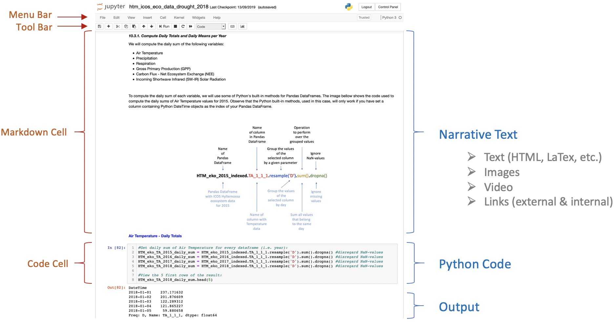

# ICOS Carbon Portal - Jupyter Solutions

 
 

## Overview
The Integrated Carbon Observation System, ICOS, is a European research infrastructure responsible for measuring, storing and disseminating standardised, high quality, long timeseries of observations on greenhouse gas concentrations in the atmosphere, as well as on carbon fluxes between the atmosphere, the earth and oceans. The ICOS station network consists of about 150 stations all over Europe, subdivided into three sepparate domains; atmopshere, ecosystem and ocean. 

For more information about ICOS please visit [https://www.icos-cp.eu/](https://www.icos-cp.eu/).

ICOS Carbon Portal is the data centre of ICOS and is responsible for storing and disseminating ICOS data. ICOS Carbon Portal also offers a range of services towards researchers/scientists, policy makers and the general public. One part of these services is based on Python-related products that are made available through various Jupyter solutions.

 
 

## Jupyter
Jupyter is a Virtual Research Environment (VRE) incorporating a collection of tools for interactive computing and sharing of computational ideas. A Jupyter VRE can host one or multiple user accounts. From within every user account, it is possible to:

- create directories
- upload data (e.g. csv, txt, netcdf, hdf, tiff, GeoTIFF, png, jpeg, etc.)
- create code files and write code (plain python code files (.py) or IPython notebook files (.ipynb))

Jupyter can support a wide range of programming languages (e.g. Python, Julia, R, Matlab, C++, C, etc.). At the moment, ICOS Carbon Portal supports solutions in Python.
 

 
 
 
 

## IPython Notebooks
An IPython Notebook is an open-source web application that allows users to create and share interactive documents that contain live code, equations, visualizations and narrative text. 

 
 

## Access to notebooks and documentation
You can find the openly available ICOS notebooks together with their corresponding ancillary data files and documentation on the ICOS Carbon Portal Jupyter repo on GitHub [https://github.com/ICOS-Carbon-Portal/jupyter](https://github.com/ICOS-Carbon-Portal/jupyter).

 
 

