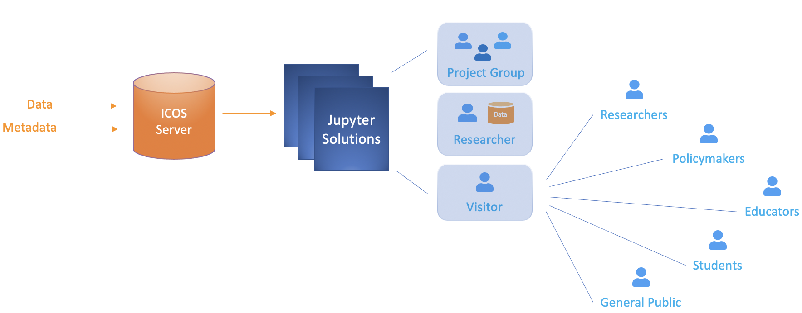
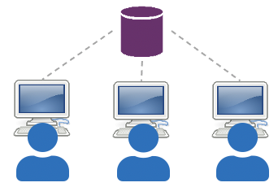
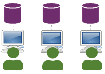
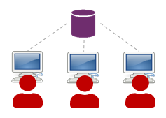

# ICOS Carbon Portal - Jupyter Solutions
ICOS data and metadata are stored on the ICOS Carbon Portal servers. ICOS goal is to provide standardized, high quality, high precision, long-time observations of greenhouse gases to estimate the carbon balance of Europe. ICOS observations can also be used to monitor the effects of climate change and raise awareness on this global problem. As part of this effort, ICOS Carbon Portal provides a range of services to scientists, policy makers, educators, students and the general public. 

To make it easier for users to access, process and interact with ICOS data, ICOS Carbon Portal offers several alternative Jupyter solutions. There are implemented solutions that allow collaboration between scientists working on the same project, by sharing data and code. Additionally, there are solutions that address the need of scientists wanting to use ICOS data in combination with their own data. Finally, ICOS Carbon Portal has developed Jupyter solutions for promoting the data, metadata and role of ICOS to people who might not have any direct link to or prior knowledge of ICOS, like researchers, policy makers, educators, students or the general public.

 
 

## Jupyter Hub
The Jupyter Hub is a service for registered users. It is aimed for researchers and research groups that make use of ICOS data as part of a funded project or as part of any other kind of collaboration. Every user receives an account and has the option to upload data, write code and create own directories. All work is saved. The user account is private and inaccessible to other users. However, if the user is part of a research group, there is the possibility of having shared directories between all members of that group. Members of the same research group can share code and data within the project group directory. Users that are not members of this research group, will not have access to the project-related directories. The Jupyter Hub runs in a Virtual Machine with docker containers. Jupyter Hub registered users run operations using ICOS CP resources. 
 
 

 
 

## Exploredata
Exploredata is a multiple purpose testing platform that is mainly used in presentations and short seminars. It is aimed for all target user groups, to test and discover the potential of IPython notebooks as a mean for presenting scientific output and visualizations of ICOS data. All notebooks on exploredata are open to the public. Exploredata is a Jupyter solution that requires log-in credentials and provides the same functionality as the Jupyter Hub, with the difference that no work is being stored. Every time a user logs in to exploredata a new Jupyter instance is created in a new docker container. The container is deleted after the user logs out or remains inactive for more than 15 minutes. Observe that exploredata can only host a limited number of users logged in at the same time.
 
 

 
 

## Temporary Jupyter Instances
A temporary Jupyter instance can be used for a course, workshop or seminar. This type of solution offers the same functionalities as the Jupyter Hub. It supports multiple users who may or may not have shared directories, though every account is private. Users may upload their own data and create their own code files and directories. All work is stored. The only difference is that this Jupyter instance, including the content from all user accounts, is deleted after the course, workshop or seminar has ended. If users wish to save their work, then they have to download it before the instance is deleted.

ICOS Carbon Portal has successfully used a temporary Jupyter instance for the purpose of a PhD-course, where all exercise material was made available in the form of IPython notebooks. 
 
 

 
 
