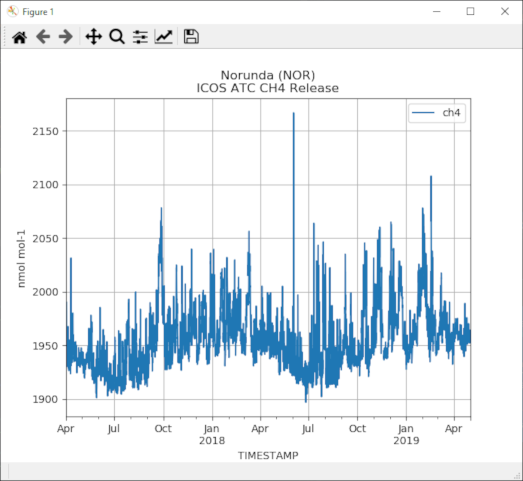

# Examples

## Digital Object

For the example below, we assume that you know how to get hold of 
the URI use at the Carbon Portal. You can read more about this in the Modules section. The following examples will use the URI [https://meta.icos-cp.eu/objects/lNJPHqvsMuTAh-3DOvJejgYc](https://meta.icos-cp.eu/objects/lNJPHqvsMuTAh-3DOvJejgYc): ICOS Atmosphere Level 2 data, Norunda, release 2019-1. Go to the landing page find more information.

### DataFrame

	from icoscp.cpb.dobj import Dobj

	dobj = Dobj('https://meta.icos-cp.eu/objects/lNJPHqvsMuTAh-3DOvJejgYc')
	data = dobj.get()
	data.head(10) 
	
Printing the first 10 rows of the data (data.head(10)) should yield the following table:

id |  Flag |  NbPoints | Stdev  |           TIMESTAMP |          ch4
-- | ----- | --------- | ------ |---------------------| ------------
0  |     N |         0 | -9.990 | 2017-04-01 00:00:00 |          NaN
1  |     N |         0 | -9.990 | 2017-04-01 01:00:00 |          NaN
2  |     O |         9 |  0.079 | 2017-04-01 02:00:00 |  1948.660034
3  |     O |        16 |  1.070 | 2017-04-01 03:00:00 |  1950.900024
4  |     O |        17 |  0.817 | 2017-04-01 04:00:00 |  1953.229980
5  |     O |        16 |  0.271 | 2017-04-01 05:00:00 |  1956.319946
6  |     O |        16 |  0.590 | 2017-04-01 06:00:00 |  1957.810059
7  |     O |        16 |  0.736 | 2017-04-01 07:00:00 |  1960.550049
8  |     O |        16 |  0.429 | 2017-04-01 08:00:00 |  1962.540039
9  |     O |        17 |  0.861 | 2017-04-01 09:00:00 |  1965.349976

### Minimalistic Plot

This first example shows how to extract a data file and create a plot. It is the easiest way to load the data into a Pandas DataFrame in your Python environment. The DataFrame contains the following columNames:
Flag, NbPoints, Stdev, TIMESTAMP, ch4. Let's load the data and create a plot for measured methan concentrations over time.

	import matplotlib.pyplot as plt
	from icoscp.cpb.dobj import Dobj

	dobj = Dobj('https://meta.icos-cp.eu/objects/lNJPHqvsMuTAh-3DOvJejgYc')
	data = dobj.get()
	data.plot(x='TIMESTAMP', y='ch4', grid=True)

	plt.show()

### Plot with Title and Units
To get a useful plot, at least we should have a title and the unit of measurement is absolutely paramount:

	import matplotlib.pyplot as plt
	from icoscp.cpb.dobj import Dobj

	dobj = Dobj('https://meta.icos-cp.eu/objects/lNJPHqvsMuTAh-3DOvJejgYc')
	data = dobj.get()

	# extract information from the dobj meta data
	# look at dobj.info() for a full list 
	unit = dobj.info[1].unit[dobj.info[1]['colName'] =='ch4'].values[0]
	title = dobj.info[0].specLabel[0]
	title = dobj.info[2].stationName[0] + ' (' + dobj.info[2].stationId[0] + ')'
	title = title + '\n'  + dobj.info[0].specLabel[0]

	plot = data.plot(x='TIMESTAMP', y='ch4', grid=True, title=title)
	plot.set(ylabel=unit)

	plt.show()
	

## Stations

### Station Id's

The function to get the station id's might be something you will use a lot. Based on a station id you can get all the dobj id's (PID/URI) and hence access to the data. So if you have no idea whatsovever what stations are available, you came to the right place:

	from icoscp.station import station
	stationList = station.getIdlist()  # returns a Pandas DataFrame
	stationList.columns  # what information do we get back?	

['uri', 'id', 'name', 'country', 'lat', 'lon', 'elevation', 'project','theme']
	
	stationList.head(5)

uri |   id    |                         name |...| project | theme |
--- | ------- | ---------------------------- |---| ------- | ----- |
... |  SE-Sto |   Abisko-Stordalen Palsa Bog |...|    ICOS |   ES  |
... |  IT-Noe | Arca di Noe - Le Prigionette |...|    ICOS |   ES  |
... |  UK-AMo |             Auchencorth Moss |...|    ICOS |   ES  |
... |  FR-Aur |                       Aurade |...|    ICOS |   ES  |
... |    11BE |              BE-SOOP-Belgica |...|    ICOS |   OS  |

 
Now you have basic information about a station, but most important you got the station id as well. NOTE: to create a station object you need to provide the station id as is **CaseSensitiv**

### A station Object
Let's create a station object and have a look what information is provided with the functin .info() . Each entry from "info" is an attribute and can be extracted with "myStation.attrib". In the following example you can access the station name with myStation.name

	from icoscp.station import station
	myStation = station.get('IT-Noe')
	myStation.info()
	

{
'stationId': 'SE-Nor', 
'name': 'Norunda', 
'theme': 'ES', 
'icosclass': '2', 
'siteType': 'Forest', 
'lat': 60.0865, 
'lon': 17.4795, 
'eas': None, 
'eag': '36', 
'firstName': 'Meelis', 
'lastName': 'Mölder', 
'email': 'meelis.molder@nateko.lu.se', 
'country': 'SE', 
'project': ['ICOS'], 
'uri': ['http://meta.icos-cp.eu/resources/stations/ES_SE-Nor']} 

	myStation.products() # return DataFrame with all products available from this station

id |                           specification     |
---|---------------------------------------------|
0  |               Drought 2018 Archive Product  |
1  |  Ecosystem meteo time series (ICOS Sweden)  |
2  | Ecosystem fluxes time series (ICOS Sweden)  |
3  |    Ecosystem eco time series (ICOS Sweden)  |
4  |               Drought 2018 FLUXNET Product  |
5  |                  ICOS ETC Archive Product   |
6  |                   ICOS ETC FLUXNET Product  |

 
 
All the dobj URI's (ultimately containing the data itself) can be retrieved with "myStation.data()"
let see what columns are provided. The most important information will be the 'dobj' column. This contains the link to the data and can be used to extract the data.

	from icoscp.station import station
	myStation = station.get('SE-Nor')
	myStation.data().columns
	
['station', 'dobj', 'spec', 'timeStart', 'timeEnd', 'specLabel','samplingheight', 'datalevel', 'bytes']

	myStation.data(level='2') # return a DataFrame with Level 2 data objects for the station

station               |  dobj                                                    |  spec
----------------------|----------------------------------------------------------|-------------------------------
...stations/ES_SE-Nor | https://meta.icos-cp.eu/objects/KfJjYyksI2nxCiJU36UfYVY_ | .../dought2018ArchiveProduct
...stations/ES_SE-Nor | https://meta.icos-cp.eu/objects/L-in6TpOcGjmXruwi3ESD9G2 | .../drought2018FluxnetProduct
...stations/ES_SE-Nor | https://meta.icos-cp.eu/objects/mBPKiB9tIQZQGrsy8ehAinvz | .../etcArchiveProduct
...stations/ES_SE-Nor | https://meta.icos-cp.eu/objects/XA_Ifq7BKqS0tkQd4dGVEFnM | .../etcFluxnetProduct

This is not the full output, just an excerpt..... most important is the dobj column. You can use the content of the column 'dobj' to extract data. Now we put everything together

	from icoscp.cpb.dobj import Dobj
	from icoscp.station import station
	myStation = station.get('SE-Nor')
	myDobj = Dobj(myStation.data().dobj[1]) # this would be the second record from above table (drought2018FluxnetProduct)
	data = myDobj.get()
	data.columns
	
['GPP_DT_VUT_REF', 'GPP_NT_VUT_REF', 'H_F_MDS', 'H_F_MDS_QC', 'LE_F_MDS','LE_F_MDS_QC', 'NEE_VUT_REF', 'NEE_VUT_REF_QC', 'RECO_DT_VUT_REF','RECO_NT_VUT_REF', 'SW_IN_F', 'SW_IN_F_QC', 'TA_F', 'TA_F_QC','TIMESTAMP', 'TIMESTAMP_END', 'VPD_F', 'VPD_F_QC']

### List of Stations
There is a built in function to extract a list of stations. Be aware that if you extract all ICOS stations, a lot of information is gathered and retrieved. At the time of writing there are over a 100 stations and in can take up to a minute to extract all.

	from icoscp.station import station
	icosStations = station.getList()
	
	for s in icosStations:
		print(s.stationId, s.name, s.lat, s.lon)

SE-Sto Abisko-Stordalen Palsa Bog 68.35596 19.04521  
IT-Noe Arca di Noe - Le Prigionette 40.60617 8.15117  
UK-AMo Auchencorth Moss 55.7925 -3.24362  
FR-Aur Aurade 43.54965 1.106103  
...

cd20200715

